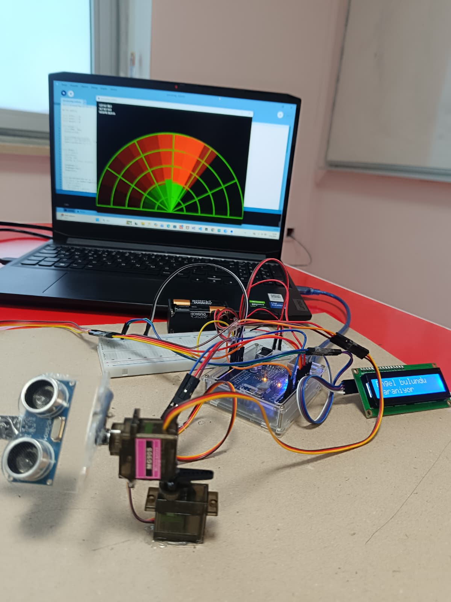

# 2-Axis Ultrasonic Radar & Object Recognition System

This repository contains the source code for a 2-axis scanning radar system that detects and classifies objects, developed as a collaborative student project.

### Project Overview

*Figure 1: Complete setup showing the Arduino-based hardware (pan-tilt mechanism, sensors) and the Processing visual interface.*

## Features
- **Dual-Axis Scanning:** 180° horizontal and 120° vertical scan using two servo motors.
- **Object Recognition:** Custom algorithm to classify obstacles as "Cup", "Pen", or "Unknown" based on dimensions and distance patterns.
- **Real-Time Visualization:** A custom-built Processing application to map sensor data into a dynamic radar interface via Serial communication.

## Technologies
- **Hardware:** Arduino Uno, HC-SR04 Ultrasonic Sensor, Servo Motors, I2C LCD.
- **Software:** Embedded C++ (Arduino IDE), Processing (Java-based).

## Project Structure
- `/Arduino`: Contains the `.ino` code for hardware control and object recognition logic.
- `/Processing`: Contains the `.pde` code for the visual radar interface.
